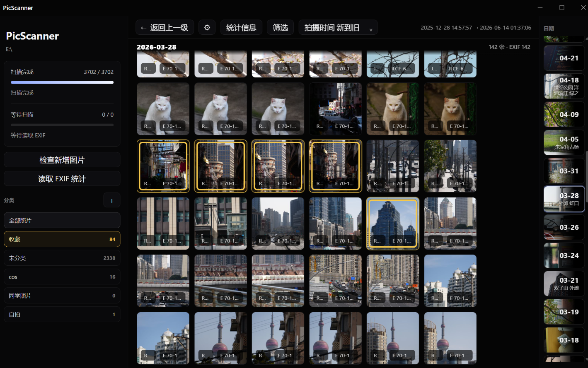

# PicScanner

PicScanner 是一个本地照片扫描、阅览、标记和统计工具，用来整理图片信息并快速查看照片 EXIF。



## 功能

- 扫描本地图片目录并读取照片信息
- 查看缩略图、灯箱预览和 EXIF 数据
- 标记、分类出片照片
- 统计常用焦段等拍摄信息

## 运行

```bash
pip install -r requirements.txt
python main.py
```
